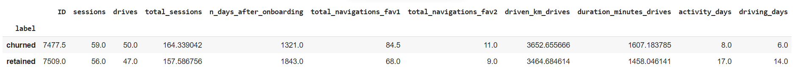

# Project: Understanding Waze User Churn

This project aims to predict user churn in the Waze app using machine learning techniques. The project comprises five notebooks, each focusing on a different aspect of the data analysis process.

- Notebook 1 - Data Understanding: Investigates and organizes the provided Waze dataset, including creating a pandas dataframe, compiling summary information about the data, and examining key variables.

- Notebook 2 - Exploratory Data Analysis (EDA): Conducts exploratory data analysis on the dataset, including data cleaning, building visualizations, and evaluating and sharing results.

- Notebook 3 - Hypothesis Testing: Performs a two-sample hypothesis test (t-test) to analyze the difference in the mean amount of rides between iPhone and Android users, communicating insights with stakeholders.

- Notebook 4 - Logistic Regression Model: Performs exploratory data analysis and builds a binomial logistic regression model to predict user churn, evaluating model performance and interpreting results.

- Notebook 5 - Random Forest and XGBoost Models: Implements Random Forest and XGBoost models to identify factors driving user churn, providing recommendations for next steps and model comparison.

Each notebook plays a crucial role in understanding the data, conducting analysis, building models, and providing insights to stakeholders regarding user churn in the Waze app.

# Notebook 1: Data Inspection and Analysis

### 1. Missing Values Analysis
- **Findings**: There were 700 missing values, all within the "label" variable. Of these, 447 belonged to iPhone users and 253 to Android users. There wasn't a clear pattern in the missing data distribution, suggesting no non-random cause.
  
### 2. Benefit of Using Median to Analyze Outliers
- **Benefits**: Using the median instead of the mean allows for the elimination of outliers, preventing them from unduly affecting the portrayal of a typical user.

### 3. Further Questions
- **Insights**: The analysis revealed the presence of "superdrivers," users who undertake extremely long trips. Further investigation into these users is necessary to better understand the causes of churn.

### 4. Percentage of Android vs. iPhone Users
- **Analysis**: Android users represent approximately 36%, while iPhone users represent 64% of the total.

### 5. Distinguishing Characteristics of Churned Users
- **Findings**: Users who churned tended to have around 3 more trips, drove 200 km more, had trips approximately 2.5 hours longer, had half the activity days, drove 361 km more per day than retained users, and made 5 more trips per day.

### 6. Churn Rate Comparison Between iPhone and Android Users
- **Observation**: No appreciable difference in churn rate was observed between iPhone and Android users; the percentages were similar.
