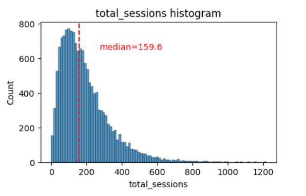
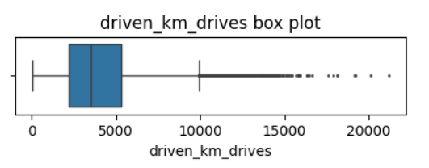
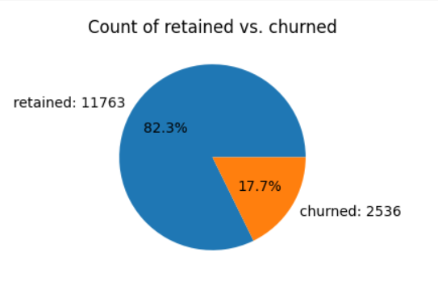
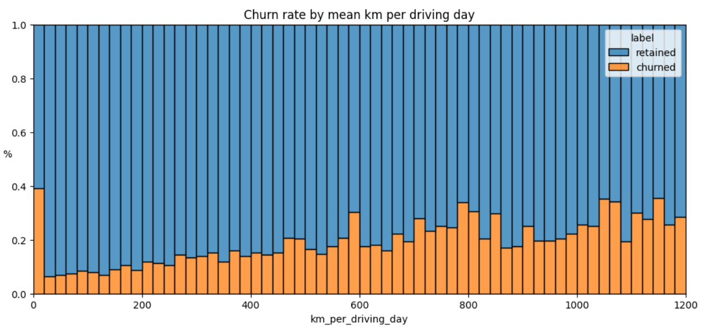
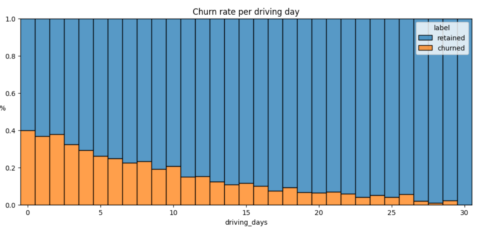
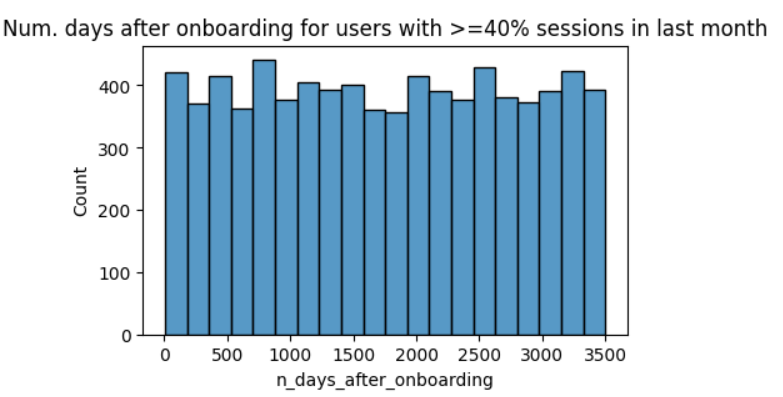
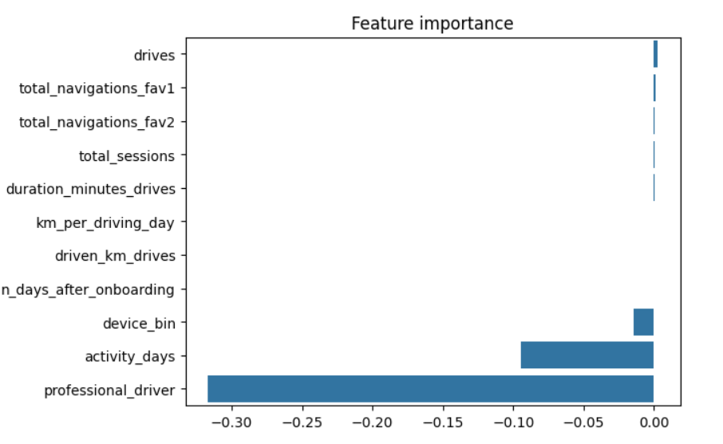
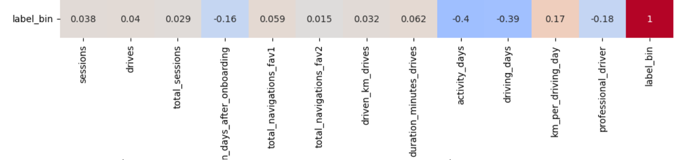

# Project: Understanding Waze User Churn

This project aims to predict user churn in the Waze app using machine learning techniques. The project comprises five notebooks, each focusing on a different aspect of the data analysis process.

- Notebook 1 - Data Understanding: Investigates and organizes the provided Waze dataset, including creating a pandas dataframe, compiling summary information about the data, and examining key variables.

- Notebook 2 - Exploratory Data Analysis (EDA): Conducts exploratory data analysis on the dataset, including data cleaning, building visualizations, and evaluating and sharing results.

- Notebook 3 - Hypothesis Testing: Performs a two-sample hypothesis test (t-test) to analyze the difference in the mean amount of rides between iPhone and Android users, communicating insights with stakeholders.

- Notebook 4 - Logistic Regression Model: Performs exploratory data analysis and builds a binomial logistic regression model to predict user churn, evaluating model performance and interpreting results.

- Notebook 5 - Random Forest and XGBoost Models: Implements Random Forest and XGBoost models to identify factors driving user churn, providing recommendations for next steps and model comparison.

Each notebook plays a crucial role in understanding the data, conducting analysis, building models, and providing insights to stakeholders regarding user churn in the Waze app.

# Notebook 1: Data Inspection and Analysis

### 1. Missing Values Analysis
- **Findings**: There were 700 missing values, all within the "label" variable. Of these, 447 belonged to iPhone users and 253 to Android users. There wasn't a clear pattern in the missing data distribution, suggesting no non-random cause.
  
### 2. Benefit of Using Median to Analyze Outliers
- **Benefits**: Using the median instead of the mean allows for the elimination of outliers, preventing them from unduly affecting the portrayal of a typical user.

### 3. Further Questions
- **Insights**: The analysis revealed the presence of "superdrivers," users who undertake extremely long trips. Further investigation into these users is necessary to better understand the causes of churn.

### 4. Percentage of Android vs. iPhone Users
- **Analysis**: Android users represent approximately 36%, while iPhone users represent 64% of the total.

### 5. Distinguishing Characteristics of Churned Users
- **Findings**: Users who churned tended to have around 3 more trips, drove 200 km more, had trips approximately 2.5 hours longer, had half the activity days, drove 361 km more per day than retained users, and made 5 more trips per day.

### 6. Churn Rate Comparison Between iPhone and Android Users
- **Observation**: No appreciable difference in churn rate was observed between iPhone and Android users; the percentages were similar.

# Notebook 2: Exploratory Data Analysis (EDA)

### 1. Distributions of Variables

- **Findings**: Most variables exhibited either right-skewed or uniform distributions. This indicates that most users had values at the lower end of the range for right-skewed distributions, while for uniform distributions, users were generally equally likely to have values anywhere within the range for that variable.

### 2. Data Quality Assessment

- **Insights**: Most of the data was not problematic, and there was no indication that any single variable was completely wrong. However, several variables had highly improbable or perhaps even impossible outlying values, such as `driven_km_drives`. Some of the monthly variables also might be problematic, such as `activity_days` and `driving_days`, because one has a max value of 31 while the other has a max value of 30, indicating that data collection might not have occurred in the same month for both of these variables.

### 3. Further Questions
- **Discoveries**: The investigation led to additional questions about the consistency of monthly data collection and the sudden changes in user behavior in the last month. It would be important to inquire whether the monthly variables were collected during the same month and if there were any changes that could have prompted this behavior.

### 4. Churn and Retention Rates

- **Analysis**: Less than 18% of users churned, while approximately 82% were retained.

### 5. Factors Correlated with Churn

    
    

- **Insights**: Distance driven per driving day had a positive correlation with user churn. The farther a user drove on each driving day, the more likely they were to churn. On the other hand, the number of driving days had a negative correlation with churn. Users who drove more days in the last month were less likely to churn.

### 6. Representation of Newer Users

- **Findings**: Users of all tenures from brand new to approximately 10 years were relatively evenly represented in the data. This is borne out by the histogram for `n_days_after_onboarding`, which reveals a uniform distribution for this variable.

# Notebook 3: Hypothesis Testing

$H_0$: The difference in the means is due to chance. So, both means are equal.

$H_A$: The difference in the means is statistically significant.

### 1. Mean Difference in Drives between iPhone and Android Users
-  **Findings**: The p-value of 0.14 is greater than the significance level of 0.05, so the tests fail to reject the null hypothesis. This means that the difference between the means of drives by Android and iPhone users is due to chance.

### 2. Further Questions
- **Exploration**: One potential next step is to explore what other factors influence the variation in the number of drives, and run additional hypothesis tests to learn more about user behavior. Furthermore, temporary changes in marketing or user interface for the Waze app may provide more data to investigate churn.

# Notebook 4: Logistic Regression Model Analysis

### 1. Influential Variable in Model's Prediction
{:width="100px"}
- **Insights**: The variable "professional_driver" had the most influence on the model's prediction, indicated by its relatively large absolute coefficient value of -0.31698. This variable was strongly correlated with `driving_days`, known from EDA to have a negative correlation with churn.

### 2. Unexpected Predictor Variables

- **Observation**: Despite previous EDA suggesting that `km_per_driving_day` would be a strong predictor, it was not as important in the model. The correlation heatmap revealed it to have the strongest positive correlation with churn, yet it ranked among the least important variables in the model.

### 3. Importance of Variables in the Model
- **Explanation**: In a multiple logistic regression model, variables can interact with each other, leading to counterintuitive relationships. This complexity can make some features appear less important in the model than initially expected, highlighting the intricacies of predictive modeling.

### 4. Recommendation for Model Usage
- **Recommendation**: Considering the balanced performance and the nature of the Waze application, it's reasonable to consider using this model as a starting point. Further optimization based on business goals and domain expertise feedback could enhance its performance. Continuous monitoring and updates based on new data and user behavior changes are advisable.

### 5. Improving the Model
- **Suggestions**: Engineering new features, scaling predictor variables, and experimenting with different combinations of predictors could enhance the model's performance by reducing noise from unpredictive features.

### 6. Additional Features for Model Improvement
- **Enhancements**: Having drive-level information for each user, granular data on user interactions with the app, and monthly counts of unique starting and ending locations for drivers would provide valuable insights for improving the model's predictive capabilities.

